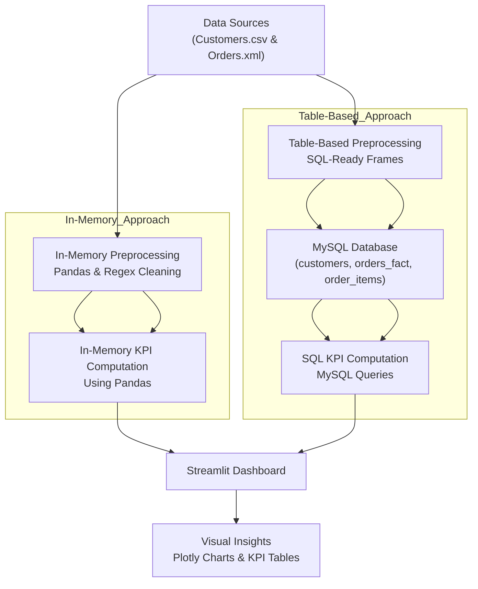

# 🛫 Akasa Air – Data Engineering Task (Customer & Orders ETL Pipeline)

This project implements a **complete data engineering workflow** To process and analyze customer and order data from multiple sources (CSV and XML) using both database table and data-frame (in-memory) approaches. It performs **data ingestion, cleaning, preprocessing, storage, KPI computation, and visualization** using both a **Table-Based (MySQL)** and **In-Memory (Pandas)** approach.

---

## 🚀 Objectives

- Ingest and process **two daily source files**:
  1. `task_DE_new_customers.csv`
  2. `task_DE_new_orders.xml`
- Perform **data cleaning, normalization, and transformation**
- Compute business KPIs:
  - Repeat Customers  
  - Monthly Order Trends  
  - Regional Revenue  
  - Top Customers (Last 30 Days)
- Implement **Time Zone normalization (Asia/Kolkata → UTC)**
- Build both:
  - **Table-Based Approach** → uses MySQL database  
  - **In-Memory Approach** → uses Python (Pandas)
- Provide **visual insights and dashboards** using Streamlit & Plotly

---

## 🧩 Architecture Overview


---
## 🧠 Design Summary

### 🧩 In-Memory Approach
- Implemented entirely in **Python** (`pandas`, `lxml`, `pytz`)
- Reads both **CSV** and **XML** directly
- Cleans and normalizes data:
  - Removes invalid region values  
  - Extracts last 10 digits of mobile numbers  
  - Converts timestamps to **UTC**
- Performs KPIs and generates interactive **Plotly** charts  
- Used for fast testing, analysis, and local insights


### 🗃️ Table-Based Approach
- Cleans data and loads it into **MySQL** tables:
  - `customers`  
  - `orders_fact`  
  - `order_items`
- Optimized with foreign keys and indexes  
- Runs the same KPIs using **SQL queries**  
- Serves as a scalable, persistent backend for analytics

---

### 🔗 Unified View
After preprocessing, both approaches create a **unified dataset** for analysis:

| customer_id | customer_name | mobile_number | region | order_id | order_date_time_utc | total_amount |
|--------------|----------------|----------------|---------|-----------|----------------------|---------------|
| CUST-001 | name | 91XXXXXXXX | West | ORD-ID | 2025-10-12 03:45 UTC | 7000.0 |

---
## ⚙️ Implementation Details

| **Layer** | **Technology / Library** | **Purpose** |
|------------|---------------------------|--------------|
| **Language** | Python 3.12 | Core implementation |
| **Database** | MySQL 8.x | Persistent storage |
| **ETL** | pandas, lxml | Cleaning & transformation |
| **Timezone Handling** | pytz | Normalize to UTC |
| **ORM / DB Access** | SQLAlchemy + PyMySQL | Load & query data |
| **Visualization** | Streamlit + Plotly | KPI dashboard |
| **Config** | dotenv | Secure credential loading |
| **Logging** | Standard Python logging | Error tracking |

---

## 📑 KPIs Implemented

| **KPI** | **Description** |
|----------|------------------|
| **Repeat Customers** | Customers with more than one unique order |
| **Monthly Order Trends** | Orders and revenue aggregated by month |
| **Regional Revenue** | Total sales grouped by customer region |
| **Top Customers (Last 30 Days)** | Highest-spending customers within recent 30 days |

All KPIs are generated in both:
- **SQL (table-based)**  
- **Pandas (in-memory)**
  
---
## 🧼 Data Cleaning Rules

| **Field** | **Transformation** |
|------------|--------------------|
| `mobile_number` | Remove non-digits → keep last 10 digits → convert to `int64` |
| `order_date_time` | Localize **Asia/Kolkata** → convert to **UTC** |
| `region` | Replace nulls with `"Unknown"` |
| `duplicates` | Drop duplicates on `mobile_number` and `order_id` |

---

## 🧠 How to Run the Application
### 1) Clone the repository
```
git clone <repo-url>
cd <Work-dir>
```
### Create virtual environment
```
python -m venv .venv
.venv\Scripts\activate
```
###3️⃣ Install dependencies
```
pip install -r requirements.txt

```
### 4️⃣ Configure environment
Create Database
```
CREATE DATABASE akasa_de;

```
Edit .env
```
DB_HOST=localhost
DB_PORT=3306
DB_USER=db_user_name
DB_PASSWORD=db_user_password
DB_NAME=akasa_de
TIMEZONE=Asia/Kolkata
```
### 5️⃣ Run ETL pipeline
```
python run_pipeline.py
```

### 6️⃣ Launch Streamlit dashboard
```
streamlit run src/dashboard/streamlit_app.py
```

## 📊 Dashboard Preview

- 📈 **Monthly Orders** → interactive bar chart  
- 💰 **Regional Revenue** → revenue by zone  
- 👨‍💼 **Top Customers** → Top 10 spenders  
- 🔁 **Repeat Customers** → dynamic table
  
------------

## 🕒 Time-Zone Awareness
All order_date_time values are localized from Asia/Kolkata to UTC before KPI calculations and storage, ensuring consistent 30-day rolling calculations regardless of system time.

----------
